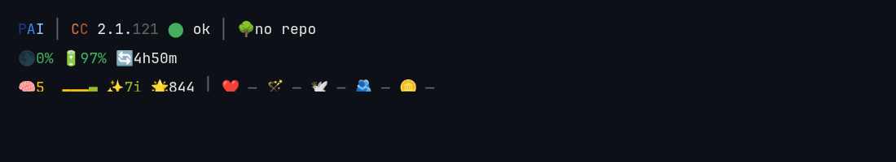
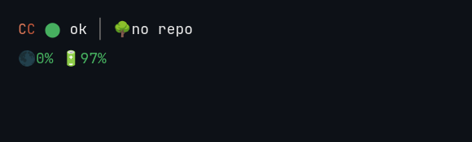

# PAI statusline

Dense 2-line personal statusline for [PAI](https://github.com/danielmiessler/pai), using [Claude Code](https://claude.com/product/claude-code).


## What it shows

| Section | Symbol | Example | Info |
|---------|--------|---------|------|
| Identity | <span style="color:rgb(30,58,138)">P</span><span style="color:rgb(59,130,246)">A</span><span style="color:rgb(147,197,253)">I</span> | 4.0.3 | PAI version (hidden if latest, outdated segments dimmed) |
| | <span style="color:rgb(217,119,87)">C</span><span style="color:rgb(191,87,59)">C</span> | 2.1.<span style="color:rgb(99,99,99)">70</span> | Claude Code version (hidden if latest, outdated segments dimmed) |
| | <span style="color:rgb(70,175,95)">⬤</span> | ok | Claude Code status |
| Session | ⏳ | 1h23m | Session time |
| | 📍 | myproject | Starting directory |
| | 🌳 | <span style="color:rgb(74,222,128)">clean</span> | Git tree state |
| Usage | 🌑🌘🌗🌖🌕 | <span style="color:rgb(255,193,7)">65%</span> | Context moon phase + % (fills as context grows) |
| | 🔋 | <span style="color:rgb(150,190,40)">65%</span> | 5-hour budget remaining % |
| | 🔄 | 3h30m | Time to reset (countdown) |
| Learning | 🧠 | <span style="color:rgb(150,190,40)">7.1</span> <span style="color:rgb(150,190,40)">▄</span><span style="color:rgb(255,193,7)">▃</span><span style="color:rgb(150,190,40)">▄</span><span style="color:rgb(70,175,95)">▅</span><span style="color:rgb(150,190,40)">▄</span> | Average rating + ratings bar (last 5) |
| | ✨ | <span style="color:rgb(150,190,40)">8</span>i | Last rating (i=implicit, e=explicit) |
| | ⭐/🌟 | 12 | Ratings count (🌟 if rated in last hour) |

## Automatic resizing

The statusline adapts to your terminal width, picking the largest statusline that fits:

**full**<br>


**dense**<br>


**ultradense**<br>


## Installation via PAI (recommended)

In any PAI session, say:

> Install codeberg.org/fishbowl/pai-statusline

PAI will clone the repo, read the setup instructions, and handle the rest.

## Installation via manual labour

1. Copy the script:

```bash
mkdir -p ~/.claude
cp statusline-command.sh ~/.claude/statusline-command.sh
chmod +x ~/.claude/statusline-command.sh
```

2. Add to `~/.claude/settings.json` (create the file with `{}` if it doesn't exist):

```json
{
  "statusLine": {
    "type": "command",
    "command": "~/.claude/statusline-command.sh"
  }
}
```

3. Add the auto-update hook to `~/.claude/settings.json` under `hooks.SessionStart`:

```json
{
  "hooks": {
    "SessionStart": [
      {
        "hooks": [
          {
            "type": "command",
            "command": "curl -sf --connect-timeout 1 -o ~/.claude/statusline-command.sh \"https://codeberg.org/fishbowl/pai-statusline/raw/branch/main/statusline-command.sh?t=$(date +%s)\" && chmod +x ~/.claude/statusline-command.sh"
          }
        ]
      }
    ]
  }
}
```

This downloads the latest version on every session start. The `?t=` cache-buster bypasses Codeberg's CDN cache (5-min TTL). Fails silently if offline, with a 1-second connect timeout.

## Auto-update

The statusline auto-updates on every session start via a `SessionStart` hook. The hook uses a `?t=` cache-buster to bypass Codeberg's CDN cache — typically adding ~50-150ms to startup.

To update manually in any PAI session, say:

> Update statusline from codeberg.org/fishbowl/pai-statusline

## Configuration

The statusline reads configuration from `settings.json`:

| Key | Default | Description |
|-----|---------|-------------|
| `contextDisplay.compactionThreshold` | `100` | Scale context % so this threshold = 100%. Set to `62` if your compaction triggers at 62%. |
| `principal.timezone` | `UTC` | Your timezone for reset time display (e.g., `America/New_York`) |
| `pai.version` | `--` | PAI version string |
| `counts.ratings` | `0` | Total ratings count (populated by PAI stop hooks) |

## How it works

The script receives JSON from Claude Code via stdin containing session data (context window, model, tokens, etc.). It then:

1. Parses settings + input JSON in two `jq` calls (all data extracted upfront)
2. Launches git status in a background subshell
3. Sources pre-built `.sh` caches for usage and service status (instant, no parsing)
4. Detects terminal width and picks the largest density that fits (full → dense → ultradense)
5. Renders four sections: Identity, Session, Usage, Learning
6. Fire-and-forget: refreshes usage/status/version caches in background for next render

Typical render time: ~100ms.

## Dependencies

- `bash` (4.0+)
- `jq` (JSON processing)
- `date` (GNU coreutils, for timezone/time calculations)
- `git` (optional, for git status info)
- `curl` (for Claude Code service status + usage API)

## License

[AGPL-3.0](LICENSE)
