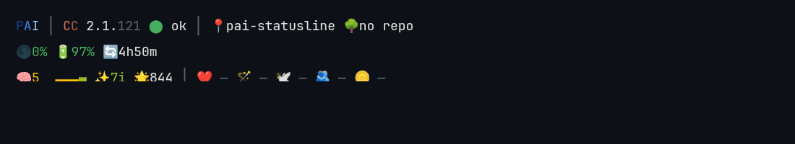
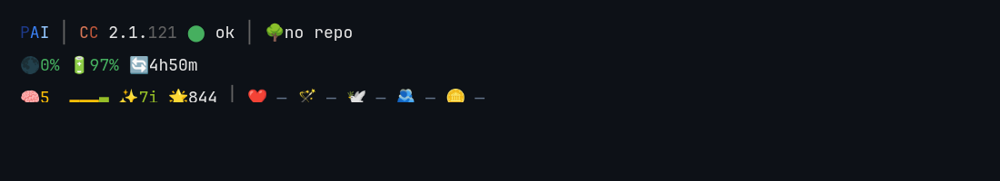
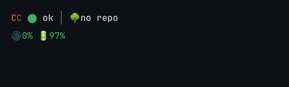

# LifeOS statusline

Dense personal statusline for **[LifeOS 7.1.1](https://github.com/danielmiessler/LifeOS)**, using [Claude Code](https://claude.com/product/claude-code). Renders identity + session on line 1, usage on line 2, and an optional learning + Telos-state row on line 3. A quote row is also available behind a flag.

> Built for the LOS 7.1.1 path layout: `CLAUDE_HOME` (`$HOME/.claude`) holds Claude-Code–managed files; `LIFEOS_DIR` (`$CLAUDE_HOME/LIFEOS`) holds LifeOS assets — including this script. Pre-5.0 layouts are not supported; see git history for the legacy script.



> ⚠️ Screenshots in this README are auto-generated (chromium headless render via Noto Color Emoji) — emoji aesthetics differ from a real terminal. Real terminal captures coming once the dev wakes up.

## What it shows

| Section | Symbol | Example | Info |
|---------|--------|---------|------|
| Identity | <span style="color:rgb(30,58,138)">L</span><span style="color:rgb(59,130,246)">O</span><span style="color:rgb(147,197,253)">S</span> | 7.1.1 | LOS version (hidden if latest, outdated segments dimmed) |
| | <span style="color:rgb(217,119,87)">C</span><span style="color:rgb(191,87,59)">C</span> | 2.1.<span style="color:rgb(99,99,99)">121</span> | Claude Code version (hidden if latest, outdated segments dimmed) |
| | <span style="color:rgb(70,175,95)">⬤</span> | ok | Claude Code service status |
| Thinking (line 1 left) | 💡 | 4h2m | All-time total thinking time across all sessions (model-busy wall-clock — API roundtrip + tool latency + extended thinking + token gen). On by default; opt-out with `statusline.showThinkingTime: false` |
| Session wall-clock (line 1 left) | ⏳ | 1h23m | Session wall-clock time. **Hidden by default**, opt-in with `SHOW_TIME=1` |
| Session | 📍 | myproject | Starting directory (locked at session start) |
| | 🌳 | <span style="color:rgb(74,222,128)">clean</span> | Git tree state (clean / staged / unstaged / untracked) |
| | 📂 / ✏️ | <span style="color:rgb(150,190,40)">3</span>r <span style="color:rgb(255,193,7)">2</span>w ↳ file.ts | Read / Edit+Write tool calls since the last user prompt; ↳ = last touched file (↗ if outside cwd) |
| Usage | 🌑🌘🌗🌖🌕 | <span style="color:rgb(255,193,7)">65%</span> | Context moon phase + % (fills as context grows) |
| | 🔋 | <span style="color:rgb(150,190,40)">97%</span> | 5-hour budget remaining % |
| | 🔄 | 4h50m | Time to reset (countdown) |
| | 🗓️ | 6d | Days (or hours, if <24h) until 7-day budget reset (Claude Code ≥2.1.x with native rate_limits) |
| Thinking (line 2 left) | ⏳ | 14m | Current-session thinking time — model-busy wall-clock for this session only |
| Learning | 🧠 | <span style="color:rgb(150,190,40)">7.1</span> <span style="color:rgb(150,190,40)">▄</span><span style="color:rgb(255,193,7)">▃</span><span style="color:rgb(150,190,40)">▄</span><span style="color:rgb(70,175,95)">▅</span><span style="color:rgb(150,190,40)">▄</span> | Average rating + sparkbar of last 5 ratings |
| | ✨ | <span style="color:rgb(150,190,40)">8</span>i | Last rating (i=implicit, e=explicit) |
| | ⭐/🌟 | 12 | Ratings count (🌟 if rated in last hour) |
| State | <span style="color:rgb(56,189,248)">❤️</span> <span style="color:rgb(147,197,253)">🪄</span> <span style="color:rgb(59,130,246)">🕊️</span> <span style="color:rgb(96,165,250)">🫂</span> <span style="color:rgb(37,99,235)">🪙</span> | 68% 31% 78% 84% 42% | Telos dimensions from `$LIFEOS_DIR/USER/TELOS/LIFEOS_STATE.json` — Health, Creative, Freedom, Relationships, Money. Missing dims render as `—` |
| Quote | "…" — | "Strive not to be a success…" —Albert Einstein | Off by default. Opt-in via `statusline.showQuote: true` in `settings.user.json` (see Configuration); sourced from `$LIFEOS_DIR/.quote-cache` (ZenQuotes refresh) |

## Automatic resizing

The statusline adapts to your terminal width, picking the largest statusline that fits:

**full**<br>


**dense**<br>


**ultradense**<br>


## Installation via LifeOS (recommended)

In any LifeOS session, say:

> Install codeberg.org/ljubitje/lifeos-statusline

LifeOS will clone the repo, read the setup instructions, and handle the rest.

## Installation via manual labour

The statusline script lives under `$LIFEOS_DIR` (default `$HOME/.claude/LIFEOS`) — alongside the rest of your LifeOS-shipped assets. `$HOME/.claude` (`CLAUDE_HOME`) holds only Claude-Code–managed files (`settings.json`, `hooks/`).

> ⚠️ **Never write to `~/.claude/settings.json` directly.** In LOS 7.1.1 it is a **generated artifact** — `MergeSettings` rebuilds it on every session start from `settings.system.json` (factory) ⊕ `settings.user.json` (yours), and re-attaches hooks from `hooks/hooks.json`. Anything placed directly in `settings.json` is **silently overwritten on the next session start** (this is the exact bug earlier versions of this README caused). So the statusLine goes into the **user overlay** and the update hook into the **hooks canon** — the sources the generator reads — never into the generated file.

1. Copy the script:

```bash
mkdir -p "${LIFEOS_DIR:-$HOME/.claude/LIFEOS}"
cp statusline-command.sh "${LIFEOS_DIR:-$HOME/.claude/LIFEOS}/statusline-command.sh"
chmod +x "${LIFEOS_DIR:-$HOME/.claude/LIFEOS}/statusline-command.sh"
```

2. Register the statusLine in the **user overlay** `settings.user.json` — **not** `settings.json`. Create `$LIFEOS_DIR/USER/CONFIG/settings.user.json` with `{}` if it doesn't exist, then add:

```json
{
  "statusLine": {
    "type": "command",
    "command": "$HOME/.claude/LIFEOS/statusline-command.sh"
  }
}
```

`MergeSettings` merges this into `settings.json` on every session start with *user-wins* semantics, so it survives regeneration. The `$HOME` is **not** expanded by the merge (the merged `settings.json` keeps the literal `$HOME/...` string) — Claude Code runs the statusLine `command` through a shell, which expands `$HOME` at execution time. (Verified on a live LOS 7.1.1 box: the generated `settings.json` carries the literal `$HOME` and the statusline renders correctly.)

3. Register the **version-gated auto-update hook** in the **hooks canon** `~/.claude/hooks/hooks.json` — **not** `settings.json`. Append this object to the existing `SessionStart` group's `hooks` array (`MergeSettings` re-attaches `hooks/hooks.json` into the generated `settings.json`, so a hook registered here survives regeneration):

```json
{
  "type": "command",
  "command": "D=\"${LIFEOS_DIR:-$HOME/.claude/LIFEOS}\"; mkdir -p \"$D/MEMORY/STATE\"; MK=\"$D/MEMORY/STATE/statusline-version.txt\"; RV=$(curl -fsS --connect-timeout 5 --max-time 10 --retry 1 --retry-all-errors \"https://codeberg.org/ljubitje/lifeos-statusline/raw/branch/main/VERSION?t=$(date +%s)\"); [ -n \"$RV\" ] && [ \"$RV\" != \"$(cat \"$MK\" 2>/dev/null)\" ] && { curl -fsS --connect-timeout 5 --max-time 20 --retry 2 --retry-delay 2 --retry-all-errors -o \"$D/statusline-command.sh.tmp\" \"https://codeberg.org/ljubitje/lifeos-statusline/raw/branch/main/statusline-command.sh?t=$(date +%s)\" && chmod +x \"$D/statusline-command.sh.tmp\" && mv \"$D/statusline-command.sh.tmp\" \"$D/statusline-command.sh\" && printf '%s' \"$RV\" > \"$MK\" || { echo \"[statusline] update to $RV FAILED — keeping cached\" >&2; echo \"$(date -Iseconds) statusline pull failed (v$RV)\" >> \"$D/MEMORY/STATE/statusline-fetch-failures.log\"; exit 1; }; }; exit 0",
  "async": true,
  "timeout": 30
}
```

## Auto-update (version-gated)

On each **session start** the hook fetches the repo's `VERSION` file — a tiny request — and compares it against the local marker `$LIFEOS_DIR/MEMORY/STATE/statusline-version.txt`. It downloads the full `statusline-command.sh` **only when the version changed**, writing it atomically (`.tmp` + `mv`) and recording the new version. The `?t=` cache-buster bypasses Codeberg's CDN cache (5-min TTL).

There is no mid-session background polling — existing long-running sessions keep the version they started with. To pull a fresh version into a running session, restart Claude Code.

Failure handling: if Codeberg is unreachable the `VERSION` check finds nothing to do and the **cached script keeps rendering** — a slow or down Codeberg never breaks your statusline (a transient `curl` error line may show in the transcript, but the hook takes no action). But if the version *did* change and the script download then fails, the hook prints a clear error to stderr, appends a timestamped line to `$LIFEOS_DIR/MEMORY/STATE/statusline-fetch-failures.log`, and exits non-zero — so a genuinely broken update surfaces instead of rotting silently.

The hook is `async` (never blocks session start) with a `timeout` of 30 s. Curl budgets: the VERSION check is `--max-time 10 --retry 1`; the (rare) script download is `--max-time 20 --retry 2 --retry-delay 2`. Under sustained Codeberg slowness the async hook may be killed at its timeout before a download lands — harmless (the cached script is untouched; the update simply retries next session).

> **Maintainer note:** because updates are version-gated, **bump `VERSION` in this repo whenever `statusline-command.sh` changes** — otherwise installs won't pull the new script. (This is the trade-off for not re-downloading the 70 KB script every session.)

To update manually in any LifeOS session, say:

> Update statusline from codeberg.org/ljubitje/lifeos-statusline

## Configuration

The statusline **reads** these keys from the merged `settings.json` at runtime — but **set them in `settings.user.json`** (`$LIFEOS_DIR/USER/CONFIG/settings.user.json`), not in `settings.json` directly. `MergeSettings` folds the user overlay into `settings.json` at each session start (user-wins); anything written straight into the generated `settings.json` is overwritten on the next start.

| Key | Default | Description |
|-----|---------|-------------|
| `contextDisplay.compactionThreshold` | `100` | Scale context % so this threshold = 100%. Set to `62` if your compaction triggers at 62%. |
| `principal.timezone` | `UTC` | Your timezone for reset time display (e.g., `America/New_York`) |
| `counts.ratings` | `0` | Total ratings count (populated by LifeOS stop hooks) |
| `statusline.showThinkingTime` | `true` | Show 💡 (all-time) and ⏳ (session) thinking-time segments. Set to `false` to disable both. |
| `statusline.showQuote` | `false` | Render an extra row with the quote from `$LIFEOS_DIR/.quote-cache`. |

### LOS 7.1.1 path layout

The statusline follows the LOS 7.1.1 split between Claude-Code–managed files and LifeOS-shipped files:

| Variable | Default | Holds |
|----------|---------|-------|
| `CLAUDE_HOME` | `$HOME/.claude` | `settings.json`, `hooks/` — Claude-Code–managed only |
| `LIFEOS_DIR` | `$CLAUDE_HOME/LIFEOS` | `MEMORY/`, `USER/`, `ALGORITHM/`, **`statusline-command.sh`**, and other LifeOS assets |

The statusline script is a LifeOS-shipped, LifeOS-updated asset, so it lives under `LIFEOS_DIR` alongside the rest. Both vars can be overridden via env. Pre-5.0 layouts (everything directly under `$HOME/.claude`) are not supported by this version — see git history for the legacy script.

### Telos state file

If you populate `$LIFEOS_DIR/USER/TELOS/LIFEOS_STATE.json` with dimension percentages, the statusline renders a STATE row showing your distance from ideal across HEALTH / CREATIVE / FREEDOM / RELATIONSHIPS / MONEY. Missing dimensions render as `—`. Run `/interview` (Phase 2) in LifeOS to populate.

## How it works

The script receives JSON from Claude Code via stdin containing session data (context window, model, tokens, etc.). It then:

1. Parses settings + input JSON in two `jq` calls (all data extracted upfront — including the native `.rate_limits` block when CC ≥2.1.x injects it, skipping the OAuth API call entirely)
2. Launches git rev-parse / branch / last-commit in a background subshell
3. Sources pre-built `.sh` caches for usage and service status (instant, no parsing)
4. Caches per-render heavy work (files block, session thinking-time) by `(session_id, transcript_size)` — append-only JSONL means same size ⇒ same content ⇒ same value, so warm renders skip the jq pass entirely
5. Detects terminal width and picks the largest density that fits (full → dense → ultradense)
6. Renders core sections (Identity, Session, Usage, Learning) plus optional rows (State, Quote) when their source data exists
7. Fire-and-forget: refreshes usage / service status / version caches in background for next render — gated to skip when native rate_limits already supplied the data

Typical render time: ~165 ms warm path on a multi-MB transcript; ratings-recompute spike (every 30 s while ratings change) is the remaining cold cost. See `IMPROVE.md` for the queued performance candidates and their trade-offs.

## Dependencies

- `bash` (4.0+)
- `jq` (JSON processing)
- `date` (GNU coreutils, for timezone/time calculations)
- `git` (optional, for git status info)
- `curl` (for Claude Code service status + usage API)

## License

[AGPL-3.0](LICENSE)
